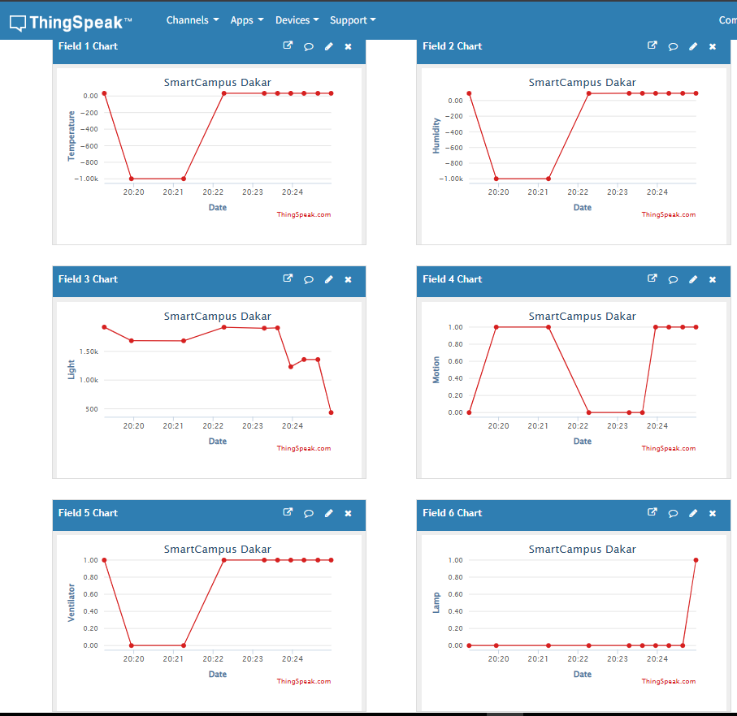

# 🌍 SmartCampus Dakar – IoT & Cloud Monitoring System

A low-cost, scalable IoT solution designed to monitor and optimize campus infrastructure (environmental conditions, occupancy, and energy usage) in resource-constrained settings.

## 📋 Project Overview
This project demonstrates a full-stack IoT pipeline: from edge hardware (ESP32 + sensors) to real-time data visualization and cloud integration. It was developed to explore how lightweight, affordable connectivity solutions can improve facility management and sustainability in African educational institutions.

## ✨ Implemented Features
- 🌡️ Real-time temperature & humidity monitoring (DHT11)
- 🔆 Ambient light detection (LDR sensor)
- 🚶 Motion/occupancy tracking (PIR HC-SR501)
- ⚡ Automated control of ventilation & lighting via relays
- 💾 Local data logging with ESP32 LittleFS
- ☁️ Cloud telemetry & analytics via ThingSpeak
- 📊 Live web dashboard with Chart.js visualization
- 🤖 Basic anomaly detection for environmental thresholds

## 🛠️ Tech Stack
| Category        | Tools & Technologies                          |
|-----------------|-----------------------------------------------|
| **Hardware**    | ESP32, DHT11, PIR HC-SR501, LDR, 2-Channel Relay |
| **Firmware**    | Arduino C++, WiFi, WebServer, LittleFS        |
| **Cloud/Telemetry** | ThingSpeak API, RESTful data ingestion      |
| **Frontend**    | HTML5, CSS3, JavaScript, Chart.js             |
| **Architecture**| Edge-to-Cloud IoT pipeline, REST integration  |

## 📸 Visuals
> *Replace placeholders with actual images when available*

## 🚀 Quick Start
### Prerequisites
- Arduino IDE 2.x or VS Code + PlatformIO
- ESP32 board package installed
- Required libraries: `DHT sensor library`, `WiFi.h`, `LittleFS`

### Setup & Deployment
1. Clone this repository
2. Open `SmartCampus.ino` in your IDE
3. Update Wi-Fi & ThingSpeak credentials (lines 27–36)
4. Flash to ESP32 & monitor via Serial Console
5. Access the local dashboard at `http://<ESP32_IP>`

## 📊 Performance & Results
- ⏱️ **Response Time**: < 2s for sensor-to-dashboard updates
- 🔄 **Reliability**: Continuous 24/7 operation with local fallback
- 🎯 **Accuracy**: DHT11 calibrated to ±2°C / ±5% RH
- 📈 **Scalability**: Designed to support multi-node expansion via MQTT/LoRaWAN (next phase)

## 🔮 Next Steps & Extensions
- Migrate from HTTP/ThingSpeak to MQTT + InfluxDB + Grafana
- Integrate LoRaWAN for long-range, low-power campus-wide coverage
- Add predictive maintenance & energy optimization algorithms
- Containerize backend services for cloud-native deployment

## 👥 Credits
**Johannes ACHA**  
*Telecommunications Engineering, ESMT Dakar*

## 🙏 Acknowledgments
- ESMT Dakar for academic support & testing environment
- Open-source IoT & Arduino communities
- ThingSpeak for accessible cloud telemetry infrastructure
